<div align="center">

# 🎮 Preditor de Partidas Dota 2

### *Prevendo Vencedores Antes do Jogo Começar*

[](https://www.python.org)
[](https://scikit-learn.org)
[](https://www.opendota.com)
[](LICENSE)

*Uma máquina pode prever o resultado de uma partida de Dota 2 analisando apenas o draft de heróis?*

[Explorar Código](https://github.com/humbertogfs55/C3018-NP2) • [Equipe](#-equipe)

</br>

</div>

## 🟢 O Desafio

**Dota 2** é um dos jogos competitivos mais complexos do mundo. Com **145+ heróis únicos** e bilhões de combinações possíveis, a fase de draft—onde times selecionam seus 5 heróis—é o primeiro campo de batalha estratégico.

**Nossa Missão**: Construir uma IA que prevê vencedores usando *apenas* composições de heróis pré-jogo.

> 💡 Sem dados de gameplay. Sem estatísticas de jogadores. Apenas análise estratégica pura.

</br>

## Por Que Isso Importa

| 🎓 Valor Acadêmico | 💼 Valor de Negócio |
|---------------------|---------------------|
| Problema de classificação de alta dimensionalidade | Suporte tático para times profissionais |
| Interações complexas entre features | Otimização de estratégias de draft |
| Aplicação real de ML | Mercado de analytics em e-sports ($1B+) |

</br>

## ⚡ Instalação e Como Executar

Antes de começar, certifique-se de ter o **Python 3.8+** instalado no sistema.

### 0. Clonar o repositório

   ```bash
   git clone https://github.com/humbertogfs55/C3018-NP2.git
   cd C3018-NP2
   ```

---

### 1. Criar ambiente virtual

   ```bash
   python -m venv .venv
   ```

> 💡 O ambiente virtual .venv isola as dependências do projeto, evitando conflitos com outros pacotes Python.

---

### 2. Ativar o ambiente virtual

#### Linux / macOS

   ```bash linux
   source .venv/bin/activate
   ```

#### Windows (CMD)

   ```cmd windows
   .venv\Scripts\activate
   ```

#### Windows (PowerShell)

   ```powershell windows
   .venv\scripts\Activate.ps1
   ```

> ✅ Após ativar, o prefixo (.venv) aparecerá antes do seu prompt de terminal.

---

### 3. Instalar dependências

1. Instalar o gerenciador de dependências `pip-tools`

    ```bash
    pip install pip-tools
    ```

2. Compilar e instalar as dependências do projeto

    ```bash
    pip-compile requirements.in
    pip install -r requirements.txt
    ```

> 💡 O arquivo requirements.in contém as dependências principais; o requirements.txt lista todas as dependências fixadas com versões específicas, permitindo reprodutibilidade.

---

### 4. Executar o projeto

Após instalar as dependências, você pode:

- Treinar o modelo:
   ```bash
   python -m src.train_model
   ```

- Gerar previsões:
   ```bash
   jupyter notebook notebooks/testing.ipynb
   ```

> 📁 Os dados processados e modelos treinados são salvos automaticamente em data/processed/ e models/.

</br>

## 📁 Geração da pasta mlruns (MLflow)

Ao rodar o comando acima, o MLflow cria automaticamente uma pasta chamada `mlruns/`, onde ficam armazenados:

- Métricas dos modelos
- Parâmetros de treino
- Artefatos (modelos, gráficos, etc.)
- Histórico completo de experimentos

### ▶️ Visualizar os experimentos no MLflow UI

Para abrir a interface visual do MLflow, execute:
   ```bash
   mlflow ui
   ```

O MLflow iniciará um servidor local normalmente em:

👉 Abra o MLflow UI clicando **[aqui](http://127.0.0.1:5000)**.

Assim você poderá navegar pelos experimentos e runs, por exemplo:

🔗 [Abrir exemplo de experimento no MLflow](http://127.0.0.1:5000/#/experiments/403649128202140705/runs/dbd051c42dff4a68a41053e9fe1885a5)

</br>

## 🔬 A Ciência

### Enquadramento do Problema
```yaml
Tipo: Classificação Binária (Aprendizado Supervisionado)
Target: radiant_win (True/False)
Features: 10 IDs de heróis (5 por time)
Dimensionalidade: ~290 features (após one-hot encoding)
```

### Pipeline de Dados

```mermaid
graph LR
    A[📥 Coleta de Dados] --> B[🧹 Pré-processamento]
    B --> C[🤖 Treinamento]
    C --> D[🎯 Predição]
    D --> E[📊 Avaliação]
    E --> F[📝 Documentação]

    %% Definições de cores e estilo com fonte maior
    classDef coleta fill:#8ecae6,stroke:#023047,stroke-width:2px,color:#000,font-weight:bold,font-size:18px;
    classDef preprocess fill:#ffb703,stroke:#fb8500,stroke-width:2px,color:#000,font-weight:bold,font-size:18px;
    classDef treino fill:#90be6d,stroke:#2b9348,stroke-width:2px,color:#000,font-weight:bold,font-size:18px;
    classDef predicao fill:#f8961e,stroke:#f3722c,stroke-width:2px,color:#000,font-weight:bold,font-size:18px;
    classDef avaliacao fill:#f9c74f,stroke:#f9844a,stroke-width:2px,color:#000,font-weight:bold,font-size:18px;
    classDef doc fill:#adb5bd,stroke:#495057,stroke-width:2px,color:#000,font-weight:bold,font-size:18px;

    %% Aplicação das classes
    class A coleta;
    class B preprocess;
    class C treino;
    class D predicao;
    class E avaliacao;
    class F doc;
```



</br>

## 🛠️ Stack Tecnológica

<div align="center">
   


</div>

**Bibliotecas Principais:**
- `scikit-learn` → Treinamento & avaliação de modelos
- `pandas` → Manipulação de dados
- `requests` → Integração com API
- `seaborn` → Visualização

</br>

## 🎓 Contexto Acadêmico

<div align="center">
   
**C318 - Tópicos Especiais II: Fundamentos de Machine Learning**
   
*Instituto Nacional de Telecomunicações (INATEL)*

</div>

Este projeto aplica técnicas de aprendizado supervisionado a dados reais de e-sports, cobrindo:
- ✅ Enquadramento do problema & coleta de dados
- ✅ Engenharia de features & pré-processamento
- ✅ Seleção de modelos & ajuste de hiperparâmetros
- ✅ Avaliação de desempenho & validação

</br>

## 📊 Resultados e Desempenho
| Modelo | Accuracy | F1-Score | Recall | ROC AUC |
|---------|-----------|----------|---------|----------|
| Random Forest | 68.2% | 80.0% | 100% | 62.5% |
| Logistic Regression | 63.6% | 75.0% | 85.7% | 56.3% |
| Gradient Boosting | 63.6% | 73.3% | 78.6% | 60.7% |

> 🔍 O modelo Random Forest apresentou o melhor desempenho, equilibrando precisão e recall com boa generalização (CV F1 = 77.6%).

</br>

## 👥 Equipe

<table align="center">
  <tr>
    <td align="center">
      <a href="https://github.com/AdsonFS">
        <br />
        <sub><b>Adson Ferreira</b></sub>
      </a><br />
      <sub>adsons@ges.inatel.br</sub>
    </td>
    <td align="center">
      <a href="https://github.com/humbertogfs55">
        <br />
        <sub><b>Humberto Gomes</b></sub>
      </a><br />
      <sub>humbertogomes@ges.inatel.br</sub>
    </td>
    <td align="center">
      <a href="https://github.com/carolinyat">
        <br />
        <sub><b>Caroliny Abreu</b></sub>
      </a><br />
      <sub>caroliny.abreu@ges.inatel.br</sub>
    </td>
  </tr>
  <tr>
    <td align="center">
      <a href="https://github.com/guilhermecmr">
        <br />
        <sub><b>Guilherme Cotta</b></sub>
      </a><br />
      <sub>guilherme.cotta@ges.inatel.br</sub>
    </td>
    <td align="center">
      <a href="https://github.com/Izalp">
        <br />
        <sub><b>Iza Lopes</b></sub>
      </a><br />
      <sub>iza.lopes@ges.inatel.br</sub>
    </td>
  </tr>
</table>

---

<div align="center">

**Se esse projeto te ajudou a draftar melhor, dá aquele GG e deixa uma ⭐ no repositório!**

[⭐ Star neste repo](https://github.com/humbertogfs55/C3018-NP2) • [🐛 Reportar Bug](https://github.com/humbertogfs55/C3018-NP2/issues) • [💡 Sugerir Feature](https://github.com/humbertogfs55/C3018-NP2/issues)

</div>
